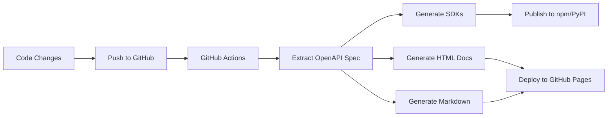

# Automated Documentation System

## Overview

TuneTrail uses **FastAPI's automatic OpenAPI generation** to create comprehensive, always-up-to-date API documentation. No manual writing required!

## 🎯 What's Automated

### 1. **Interactive API Documentation**
- **Swagger UI** at `/docs` - Try API calls directly in browser
- **ReDoc** at `/redoc` - Beautiful, readable documentation
- **OpenAPI JSON** at `/openapi.json` - Machine-readable spec

### 2. **Auto-Generated SDKs**
- Python client library
- TypeScript/JavaScript client library
- Go client library
- **All generated from OpenAPI spec** - No manual SDK maintenance!

### 3. **Static Documentation Sites**
- HTML documentation (ReDoc)
- Markdown documentation
- Automatically deployed to GitHub Pages

### 4. **API Changelog**
- Git-based changelog generation
- Version comparison
- Breaking change detection

## 📚 How It Works

### FastAPI Auto-Documentation

FastAPI automatically generates OpenAPI documentation from:
- **Function signatures** → Parameter types
- **Type hints** → Request/response schemas
- **Docstrings** → Endpoint descriptions
- **Pydantic models** → JSON schemas
- **Response models** → Response structure

**Example:**
```python
from fastapi import APIRouter, Depends
from pydantic import BaseModel

class TrackCreate(BaseModel):
    """Schema for creating a new track."""
    title: str
    artist: str
    duration_seconds: int

@router.post("/tracks", response_model=Track, tags=["Tracks"])
async def create_track(
    track_data: TrackCreate,
    current_user: User = Depends(get_current_user),
) -> Track:
    """
    Create a new music track.

    This endpoint allows you to add a new track to your library.

    Args:
        track_data: Track information including title, artist, and duration

    Returns:
        The created track with generated ID

    Raises:
        400: Invalid track data
        401: Not authenticated
        403: Insufficient permissions
    """
    # Implementation...
```

This automatically generates:
- Parameter descriptions
- Request body schema
- Response schema
- Error responses
- Example values
- Try-it-out functionality

## 🚀 Accessing Documentation

### During Development

```bash
# Start the API
docker-compose up api

# Access documentation
open http://localhost:8000/docs       # Swagger UI
open http://localhost:8000/redoc      # ReDoc
open http://localhost:8000/openapi.json  # Raw OpenAPI spec
```

### In Production

- **Swagger UI**: https://api.tunetrail.dev/docs
- **ReDoc**: https://api.tunetrail.dev/redoc
- **Static Docs**: https://docs.tunetrail.dev/api-reference

## 🔧 Generating SDKs

### Automatic (CI/CD)

SDKs are automatically generated on every merge to `main`:

```yaml
# .github/workflows/generate-docs.yml
- Commit changes to API
- GitHub Actions runs
- OpenAPI spec extracted
- SDKs generated for Python, TS, Go
- Published to package registries
```

### Manual Generation

```bash
# Generate all SDKs
./scripts/generate-sdk.sh

# Outputs:
# - sdks/python/      → pip install tunetrail-sdk
# - sdks/typescript/  → npm install tunetrail-sdk
# - sdks/go/          → go get github.com/yourusername/tunetrail-go
```

### Using Generated SDKs

**Python:**
```python
from tunetrail import TuneTrailClient

client = TuneTrailClient(api_key="tt_your_key")
tracks = client.tracks.list()
```

**TypeScript:**
```typescript
import { TuneTrailClient } from 'tunetrail-sdk';

const client = new TuneTrailClient({ apiKey: 'tt_your_key' });
const tracks = await client.tracks.list();
```

**Go:**
```go
import "github.com/yourusername/tunetrail-go"

client := tunetrail.NewClient("tt_your_key")
tracks, err := client.Tracks.List()
```

## 📖 Static Documentation

### Generate Locally

```bash
# Generate HTML, Markdown, and more
./scripts/generate-docs.sh

# Outputs:
# - docs/api-reference/index.html  (ReDoc)
# - docs/api-reference/swagger.html (Swagger)
# - docs/api-reference/API.md (Markdown)
```

### View Locally

```bash
cd docs/api-reference
python -m http.server 8080

# Open http://localhost:8080
```

## 🎨 Customizing Documentation

### 1. **Endpoint Metadata**

```python
@router.get(
    "/tracks/{track_id}",
    response_model=Track,
    tags=["Tracks"],
    summary="Get track by ID",
    description="Retrieve detailed information about a specific track",
    response_description="The requested track",
    responses={
        404: {"description": "Track not found"},
        403: {"description": "Access denied"},
    },
)
async def get_track(track_id: UUID):
    """Additional detailed description in docstring."""
    pass
```

### 2. **Schema Examples**

```python
class TrackCreate(BaseModel):
    title: str = Field(..., example="Bohemian Rhapsody")
    artist: str = Field(..., example="Queen")
    duration_seconds: int = Field(..., example=354, ge=1)

    class Config:
        json_schema_extra = {
            "example": {
                "title": "Bohemian Rhapsody",
                "artist": "Queen",
                "duration_seconds": 354,
            }
        }
```

### 3. **Global OpenAPI Configuration**

```python
# In main.py
app = FastAPI(
    title="TuneTrail API",
    description="Powerful music recommendation platform",
    version="1.0.0",
    terms_of_service="https://tunetrail.dev/terms",
    contact={
        "name": "Support",
        "email": "support@tunetrail.dev",
    },
    license_info={
        "name": "AGPL-3.0 / Commercial",
    },
)
```

## 📋 OpenAPI Tags

Organize endpoints into logical groups:

```python
app = FastAPI(
    openapi_tags=[
        {
            "name": "Tracks",
            "description": "Manage music tracks",
            "externalDocs": {
                "description": "Tracks Guide",
                "url": "https://docs.tunetrail.dev/tracks",
            },
        },
        {
            "name": "Recommendations",
            "description": "Get personalized recommendations",
        },
    ]
)
```

## 🔄 API Versioning

### URL Versioning

```python
app.include_router(tracks_v1.router, prefix="/api/v1")
app.include_router(tracks_v2.router, prefix="/api/v2")
```

### Header Versioning

```python
@app.middleware("http")
async def version_middleware(request: Request, call_next):
    version = request.headers.get("API-Version", "v1")
    request.state.api_version = version
    response = await call_next(request)
    response.headers["API-Version"] = version
    return response
```

## 📊 Documentation CI/CD Workflow



## 🛠️ Tools Used

### Documentation Generation
- **FastAPI**: Auto-generates OpenAPI spec
- **Swagger UI**: Interactive API explorer
- **ReDoc**: Beautiful API documentation
- **Widdershins**: OpenAPI → Markdown converter
- **@redocly/cli**: Static HTML generation

### SDK Generation
- **OpenAPI Generator**: Multi-language SDK generation
- Supports 50+ languages/frameworks
- Highly customizable templates
- Automatic type generation

## ✅ Best Practices

### 1. **Write Good Docstrings**
```python
async def create_track(track_data: TrackCreate):
    """
    Create a new music track.

    This endpoint adds a track to your library and automatically
    extracts audio features if available.

    **Required scopes**: `write:tracks`

    **Rate limit**: 60 requests/minute
    """
```

### 2. **Use Pydantic Models**
```python
# ✅ Good - generates schema
class TrackCreate(BaseModel):
    title: str
    artist: str

# ❌ Bad - no schema
async def create_track(title: str, artist: str):
```

### 3. **Add Examples**
```python
class Track(BaseModel):
    id: UUID = Field(example="550e8400-e29b-41d4-a716-446655440000")
    title: str = Field(example="Bohemian Rhapsody")
```

### 4. **Document Errors**
```python
@router.get(
    "/tracks/{track_id}",
    responses={
        200: {"description": "Success"},
        404: {"description": "Track not found"},
        403: {"description": "Insufficient permissions"},
    },
)
```

### 5. **Use Tags for Organization**
```python
@router.post("/tracks", tags=["Tracks", "Public"])
@router.post("/recommendations", tags=["ML", "Recommendations"])
```

## 🚦 Keeping Docs in Sync

### Automatic Updates
- ✅ Documentation updates on every code change
- ✅ SDKs regenerated on release
- ✅ Examples tested in CI/CD
- ✅ Breaking changes detected

### Manual Reviews
- PR reviews include doc changes
- Changelog updated on releases
- Migration guides for breaking changes

## 📈 Documentation Metrics

Track documentation quality:
- **Coverage**: % of endpoints documented
- **Examples**: # of code examples
- **Freshness**: Days since last update
- **SDK Downloads**: Usage metrics
- **User Feedback**: Doc ratings

## 🎓 Resources

- [FastAPI Documentation](https://fastapi.tiangolo.com/tutorial/)
- [OpenAPI Specification](https://swagger.io/specification/)
- [OpenAPI Generator](https://openapi-generator.tech/)
- [ReDoc](https://github.com/Redocly/redoc)
- [Swagger UI](https://swagger.io/tools/swagger-ui/)

## 🎉 Summary

**Zero manual documentation work needed!**

1. Write FastAPI code with type hints
2. Add docstrings
3. Documentation auto-generated
4. SDKs auto-generated
5. Deploy automatically

Your API documentation is **always accurate, always up-to-date**! 🚀